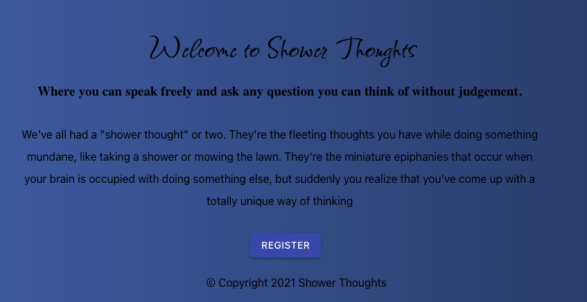

<h1 align="center">Shower Thoughts v.2</h1>


  
<br />
## Description

Shower Thoughts is a full stack application which uses React, Node, MongoDB( Mongoose) and express.
It gives a social media like experience to the user, also features JWT for authentication.

[Click Here](https://shower-thoughts-v2.herokuapp.com) to launch App!

## Table of Contents
- [Description](#description)
- [License](#license)
- [Installation](#Installation)

Run the command in the root of the directory to make sure you have all depenedencies, which can be found in the package.json file. Also make sure to install them in the client folder as well. 


```
npm install 
```
## ! When running the app, the server and the client need to be running concurrently in order to work !
## Usage
You will need two terminals: 

Run the command in the root of the directory to launch db server and react app
change directory into client and start react app
```
 cd client/ npm start
```
at the root of the directory, run command
```
node server.js
```
## Development
Want to contribute? Great!

To fix a bug or enhance an existing module, follow these steps:

- Fork the repo
- Create a new branch (`git checkout -b improve-feature`)
- Make the appropriate changes in the files
- Add changes to reflect the changes made
- Commit your changes (`git commit -m 'Improve feature'`)
- Push to the branch (`git push origin improve-feature`)
- Create a Pull Request 


## License

<br />
This application is covered by the MIT license. 
## Contributing
Eddie Ibarra
<br />